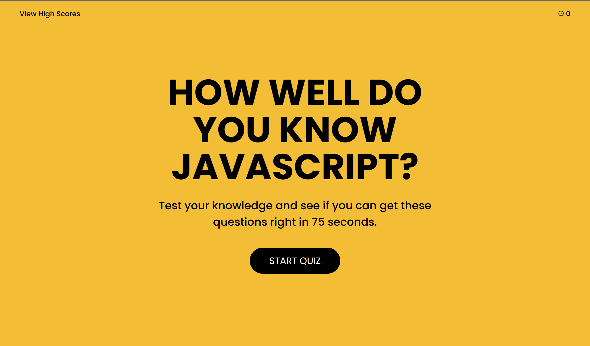
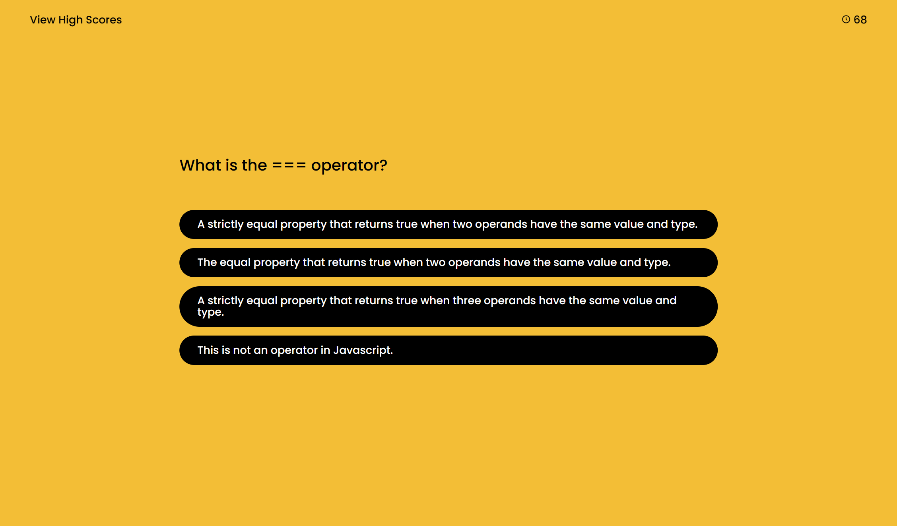
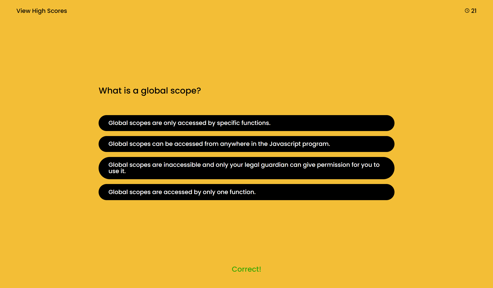
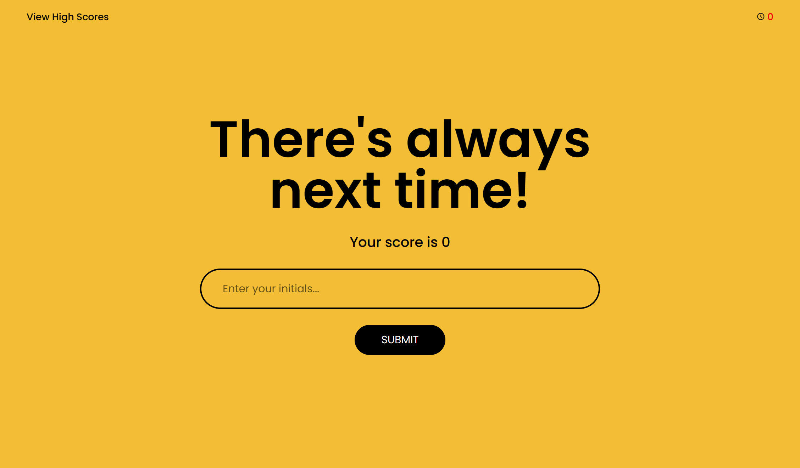
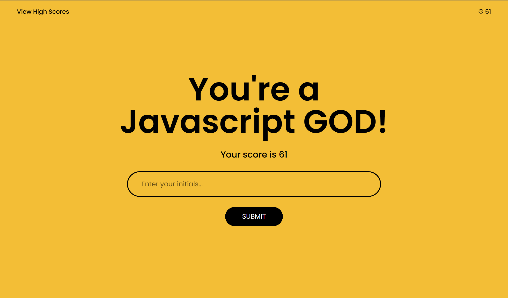
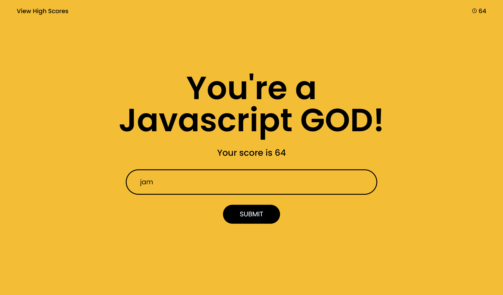
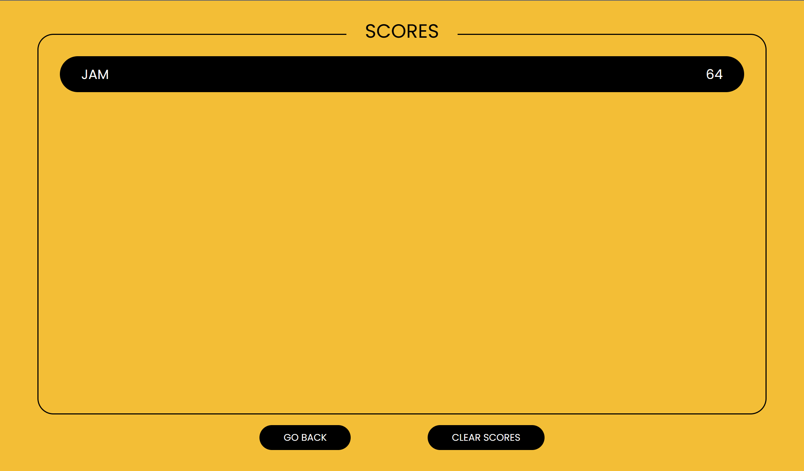

# Javascript-Quiz

## Description

The objective for this assignment was to create a Javascript quiz that allows the user to test their knowledge in Javascript. The user is scored at the very end based on how fast they are in finishing the quiz, and if they miss any question, the score is deducted by ten points. The max amount of points the user can receive is 75, and the least is 0.

This assignment helped me to improve my problem-solving and critical thinking skills. There were hurdles and multiple bugs that I ran into along the way, but throughout the assignment, I taught myself to tackle problems one thing at a time rather than trying to get everything out of the way all at once. If I couldn't solve one problem, instead of focusing all my energy on it, I'd move on to the next section and get to my main issue later. This helped me to be more productive and reduced my stress for the time-being.

GIVEN I am taking a code quiz

WHEN I click the start button

THEN a timer starts and I am presented with a question

WHEN I answer a question

THEN I am presented with another question

WHEN I answer a question incorrectly

THEN time is subtracted from the clock

WHEN all questions are answered or the timer reaches 0

THEN the game is over

WHEN the game is over

THEN I can save my initials and score

## Usage

Github deployed website: 
https://jmaduafo.github.io/Javascript-Quiz/Develop/

The user starts at this home page

After the user clicks on the "START QUIZ" button, the clock starts to run from 75 seconds
and counts down to 0. They are presented with a set of questions and choices.

If the user gets a question right, then no seconds are subtracted. If a question is answered 
wrong, then 10 seconds/points are subtracted.

Depending on the user's performance, they receive a comment based on their scores
after the quiz is finished

The user can then enter their initials in the input, and their score and initials gets recorded in
the local storage after the "SUBMIT" button is clicked

Then their record is stored in the scoreboard

If the "GO BACK" button is clicked, then the user is taken back to the home page after the window reloads.
"CLEAR SCORES" clears the scores displayed.

